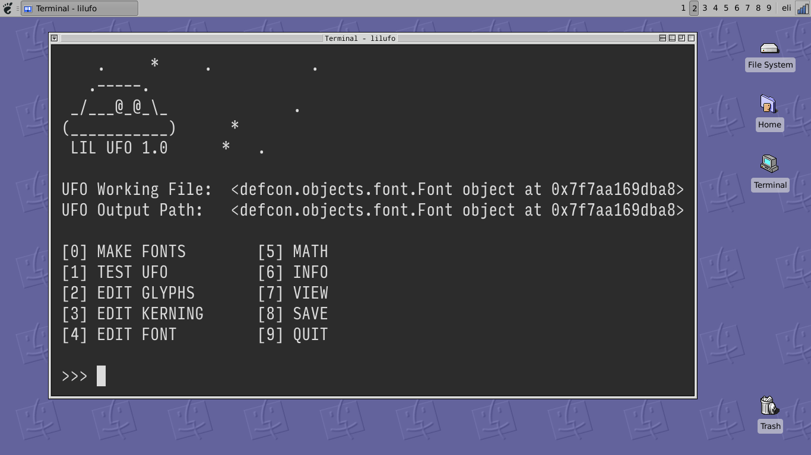

lilufo
======

A simple font editor.

Installation
============

Install **Python 3.5** (or later):

Check which version of Python3 you have installed, open a command prompt and run:

    `python3 --version`

Install Python3 for Ubuntu:

    `apt install python3`

Set up a new Python **virtual environment**. Although this is not required, it's *highly recommended*:

   `python3 -m venv lilvenv`

Start the virtual environment:

    `source ilivenv\bin\activate`

Install the dependencies as listed in `requirements.txt`:

   `pip install --upgrade -r requirements.txt`

Use pip to install LIL UFO in "editable" mode:

    `pip install --editable .`
